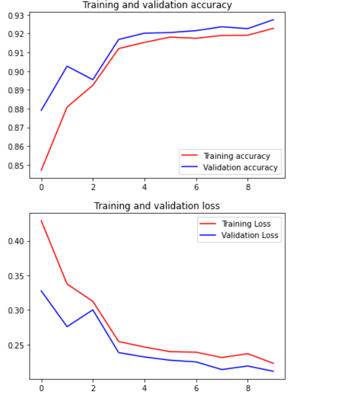
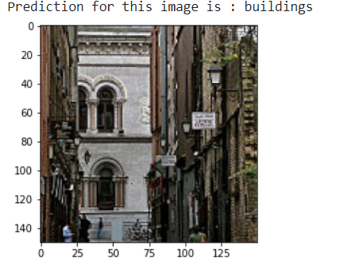
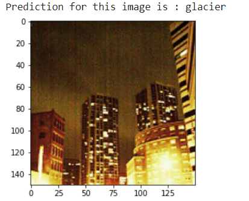
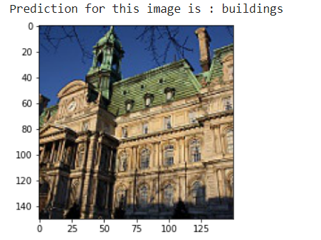
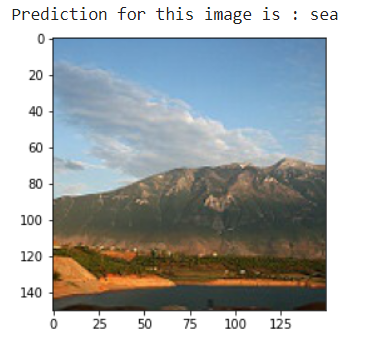

<!-- ABOUT THE Computer Vision Assignment -->
## About The Computer Vision Assignment

Image Classification is performed using natural scene imagery. Transfer learning is performed using InceptionV3 as backbone.


<!-- Code -->
## Code


### Imports

  ```sh
  import numpy as np # linear algebra
  import pandas as pd # data processing, CSV file I/O (e.g. pd.read_csv)
  import os
  from tensorflow.keras import layers
  from tensorflow.keras import Model
  from tensorflow.keras.applications import Xception
  from tensorflow.keras.optimizers import RMSprop
  from tensorflow.keras.preprocessing.image import ImageDataGenerator
  import os
  import matplotlib.pyplot as plt
  import pandas as pd
  from keras.callbacks import ReduceLROnPlateau
  ```

### Dataset Read (along with augumentation)

   ```sh
   datagen = ImageDataGenerator( rescale = 1.0/255,
                                          width_shift_range=0.1,
                                          height_shift_range=0.1,
                                          zoom_range=0.2,
                                          vertical_flip=True,
                                          horizontal_flip=True,
                                          fill_mode='nearest')

    #Load data
    train_generator = datagen.flow_from_directory(
        '/content/drive/My Drive/Assgn-2/CV_Assignment3/intel-image-classification/seg_train/seg_train/',
        target_size=(150, 150),
        shuffle=True,
        batch_size=32,
        class_mode="categorical")

    validation_generator = datagen.flow_from_directory(
        '/content/drive/My Drive/Assgn-2/CV_Assignment3/intel-image-classification/seg_train/seg_train/',
        target_size=(150, 150),
        batch_size=32,
        shuffle=True,
        class_mode="categorical")

    test_generator = datagen.flow_from_directory(
        '/content/drive/My Drive/Assgn-2/CV_Assignment3/intel-image-classification/seg_test/seg_test/',
        target_size=(150, 150),
        shuffle=True,
        batch_size=32,
        class_mode="categorical",
    )
   ```
### load the pretrained InceptionV3 model

  ```sh
  from keras.applications.inception_v3 import InceptionV3
  inceptionV3 = InceptionV3(include_top= False, input_shape=(150,150,3))

  for layer in inceptionV3.layers:
    layer.trainable = False

  last_layer = inceptionV3.get_layer('mixed9')

  print('last layer output shape: ', last_layer.output_shape)

  last_output = last_layer.output
  ``` 

### Model Set-Up for Training

  ```sh
  LearningRateScheduler = ReduceLROnPlateau(monitor='val_acc',
                                            patience=0,
                                            verbose=1,
                                            factor=0.20,
                                            min_lr=0.000001)

  x = layers.Flatten()(last_output)
  x = layers.Dense(1024, activation='relu')(x)
  x = layers.Dropout(0.2)(x)                  
  x = layers.Dense(6, activation='softmax')(x)           

  model = Model(inceptionV3.input, x) 

  model.compile(optimizer = RMSprop(lr=0.0001), 
                loss = 'categorical_crossentropy', 
                metrics = ['acc'])

  model.summary()
  history = model.fit(train_generator,
                    epochs = 10,
                    verbose = 1,
                   validation_data = validation_generator,
                   callbacks=[LearningRateScheduler])
  ``` 
### Model Evaluation

  ```sh
  acc = history.history['acc']
  val_acc = history.history['val_acc']
  loss = history.history['loss']
  val_loss = history.history['val_loss']

  epochs = range(len(acc))

  plt.plot(epochs, acc, 'r', label='Training accuracy')
  plt.plot(epochs, val_acc, 'b', label='Validation accuracy')
  plt.title('Training and validation accuracy')
  plt.legend()
  plt.figure()

  plt.plot(epochs, loss, 'r', label='Training Loss')
  plt.plot(epochs, val_loss, 'b', label='Validation Loss')
  plt.title('Training and validation loss')
  plt.legend()

  plt.show()
  ``` 
<!-- USAGE EXAMPLES -->
## Results


<!-- PROJECT LOGO -->
<br />
<p align="center">
  <a href="https://github.com/othneildrew/Best-README-Template">
    
  </a>

  <h3 align="center">Accuracy Plots of model</h3>

  
</p>


<!-- ROADMAP -->
## Test Sample Images

Sample Test Images are predicted and their results are displayed
<br />
<p align="center">
  <a href="https://github.com/othneildrew/Best-README-Template">
    
  </a>

 

  
</p>
<br />
<p align="center">
  <a href="https://github.com/othneildrew/Best-README-Template">
    
  </a>


  
</p>
<br />
<p align="center">
  <a href="https://github.com/othneildrew/Best-README-Template">
    
  </a>


  
</p>
<br />
<p align="center">
  <a href="https://github.com/othneildrew/Best-README-Template">
    
  </a>


  
</p>

